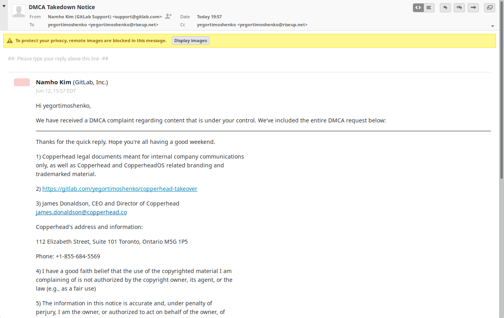

This repository contains all currently known information about
Copperhead takeover. Thanks to Jeremy Rand for finding tweets.

Most important information preserved here is Copperhead letters
to Daniel Micay and snapshots of Hacker News thread with CEO's
comments that were later deleted:

- https://yegortimoshenko.gitlab.io/copperhead-takeover/hackernews-1/
- https://yegortimoshenko.gitlab.io/copperhead-takeover/hackernews-2/

James Donaldson, CEO of Copperhead, has tried to take this repo down
via a false DMCA claim:

If you have any information that isn't listed here, please
send a merge request.
